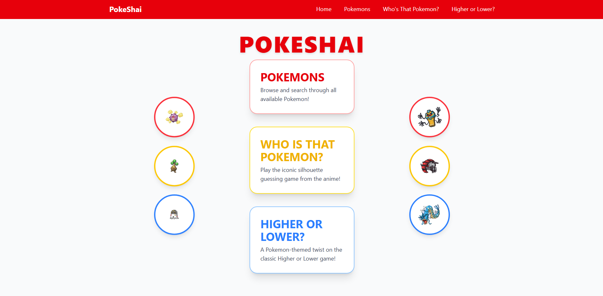
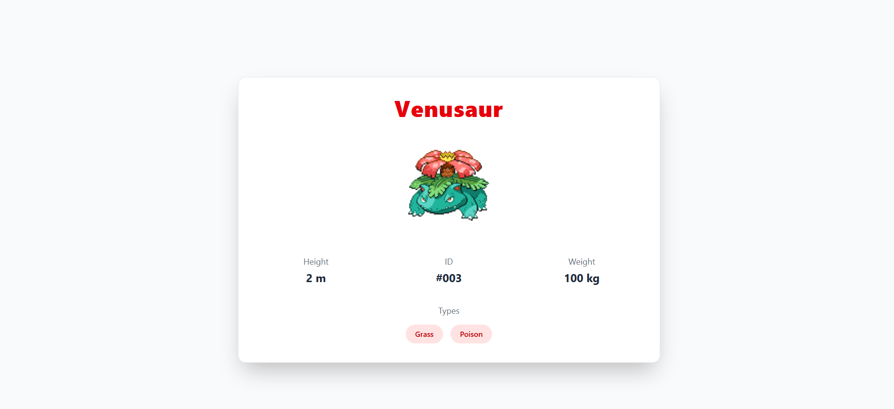
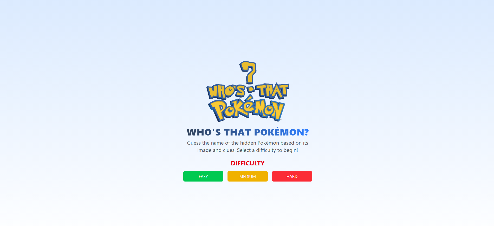
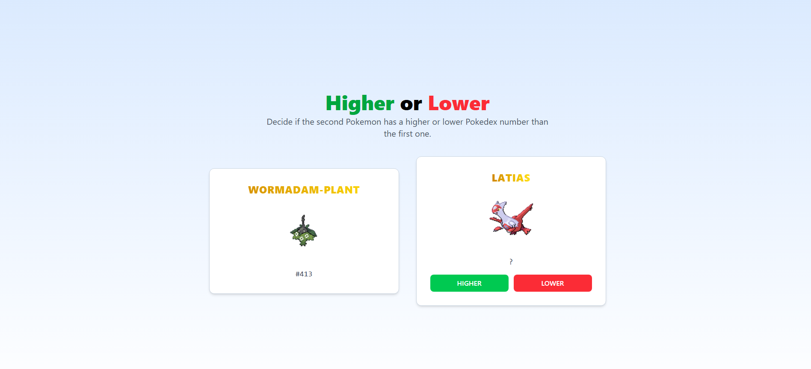

# 🔴 PokeShai

PokeShai is a full-stack educational web application where users can explore a complete Pokemon catalog, search and filter Pokémon, view their details, and enjoy two classic games: **Who Is That Pokemon** and **Higher or Lower**.

> 📌 This project was developed individually for educational purposes. It uses public data from the **PokeAPI** and is not affiliated with Nintendo or The Pokémon Company.

---

## ✨ Features

- 🔍 Pokemon Catalog with search, filters and sorting
- 📄 Pokémon details view
- 🎮 Mini-games:
  - **Who Is That Pokemon?** — guess the Pokémon by its image
  - **Higher or Lower?** — compare Pokemons by their Pokédex numbers
- 🧠 Responsive and intuitive UI
- 🌐 Consumes data from [PokeAPI](https://pokeapi.co)

---

## 📸 Screenshots

### 📚 Landing Page


### 📄 Pokemon Details


### ❓ Who Is That Pokemon?


### 🔼 Higher or Lower


---

## ⚙️ Technologies Used

- **Frontend:** React, Redux Toolkit, Tailwind CSS, Vite
- **Backend:** Node.js, Express, MongoDB
- **API Consumption:** PokeAPI
- **Other:** Axios, dotenv, Mongoose

---

## 🚀 Getting Started

### 1. Clone the repository

```bash
git https://github.com/Shaikohn/PokeShai.git
cd PokeShai

```
### 2. Install dependencies

```bash
# client
cd client
npm install

# api
cd ../api
npm install

```

### 3.  Setup your .env files
Create two .env files:

## 📁 client/.env:

```bash

VITE_BACKEND_URL=your_backend_url

```
## 📁 api/.env:

```bash

PORT=your_port
API_URL=your_api_url
MONGO_URL=your_mongodb_url

```

### 4. 📦 Run Locally

```bash
# client
cd ../client
npm run dev

# api
cd ../api
npm run dev

```

## 🙌 Credits
This project was created individually as part of a personal learning initiative. All Pokémon data is retrieved from the PokeAPI, and all content is for educational and non-commercial use only.